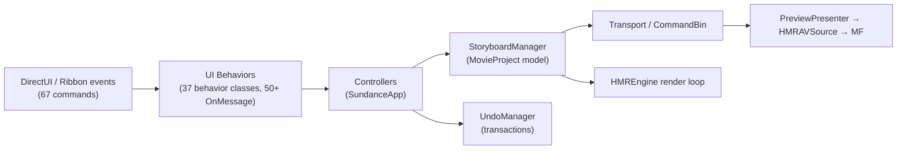

# Application Flow

## Phase 0 — the launcher (`src/MovieMaker/main.cpp`)

```cpp
int WINAPI wWinMain(HINSTANCE, HINSTANCE, LPWSTR, int) {
    // 1. Register a Vectored Exception Handler for MSVC C++ exception codes
    //    (0xe06d7363 magic + subcodes 0x19930520/21/22 and the
    //    undocumented 0x01994000). [Quirk #1]
    // 2. Resolve this executable's directory.
    // 3. LoadLibrary("MovieMakerCore.dll") — delay-load style, from the exe dir.
    // 4. GetProcAddress("MovieMakerMain") and call it (__cdecl).
    // 5. Outer __except(EXCEPTION_EXECUTE_HANDLER) wraps the call.
}
```

The launcher does **not** use COM activation for the engine — `MovieMakerCore.dll`'s CLSID
is literally all zeros ([Quirk #3](../methodology/quirks.md#3-null-clsid-for-moviemakercoredll)),
so the only way in is `LoadLibrary` + `GetProcAddress`.

## Phase 1 — engine bootstrap (`src/MovieMakerCore/dllmain.cpp`)

`MovieMakerMain` initializes the engine before any UI exists:

- COM apartment setup and the `WMMR::CoInitializer` guard.
- **D3D11 device creation** — hardware with WARP fallback, deliberately using the
  single-threaded flag ([Quirk #9](../methodology/quirks.md#9-d3d11-single-threaded-flag-for-a-video-editor)).
- **WIC imaging factory** (`windowscodecs`) for thumbnail/decode paths.
- **Media Foundation** startup (`MFStartup`).
- The **single-instance mutex** `Global\WindowsLiveMovieMaker_Sundance_SingleInstance`
  ([Quirk #2](../methodology/quirks.md#2-sundance-codename-leaked-into-runtime-objects)).
- Delay-load hooks for the optional legacy DLLs (`WLXPhotoSqm`, `DmxBici`, `wlidcli`,
  `uxcore`) so their absence cannot crash startup
  ([Quirk #11](../methodology/quirks.md#11-delay-loaded-dlls-that-no-longer-exist)).

## Phase 2 — SundanceApp (`SundanceApp/SundanceAppMain.cpp`)

`CSundanceApp` builds the application skeleton:

1. **ProjectManager** — creates the in-memory `MovieProject`, wires dirty-state tracking
   and auto-save (via **AutoSaveManager**).
2. **ImportController / ExportController** — media import and export/publish pipelines.
3. **MediaBrowser + ThumbnailCache** — media browsing surface with background thumbnail
   generation.
4. **UndoManager** — transaction-based undo/redo stack with clipboard integration
   (**ClipboardManager** owns both the system clipboard chain and the internal clipboard).
5. **CommandLineParser** — startup switches (project files, safemode).
6. **PlaybackController / TimelineController** — hook the storyboard model to the preview.

The main window is a DirectUI host: `SundanceNativeHwndHost` bridges native HWNDs into the
DirectUI element tree, and `SundanceAppDataContext` (IDispatch) feeds data-bound UI.

## Phase 3 — the Ribbon (`UI/Ribbon/`)

The Windows Ribbon Framework (`uiribbon.h`) is initialized with **67 command handlers**
and a full `UpdateState` / `ComputeCommandEnabled` pass. The MRU (most-recently-used)
project list is backed by a site registry with its own registry "Count" query semantics.
Ribbon markup ships as UIFILE resources in `MovieMakerLang.dll`
(`RT_UIFILE_RIBBON = 10000`).

## Phase 4 — storyboard model (`StoryboardManager/`)

A `MovieProject` is created (empty or from a `.wlmp` file via the
[Serialization](moviemakercore/serialization.md) reader). The model is:

- `MovieProject` → `TimelineTrack`s (0 = video, higher = audio etc.)
- Each track holds `MovieExtent`s (clips) with **Extents** arithmetic for layout/overlap.
- **Templates** define the 23 effects / 7 themes; **Theme** applies visual themes by
  patching project XML.
- **Transport** (`StoryboardManager/Transport/`) drives playback: `TransportBase` plus a
  **CommandBin** of transport commands.

## Phase 5 — rendering loop (`HMREngine/` + `Preview/`)

- `PreviewPresenter` (`Preview/PreviewPresenter.cpp`) owns the D3D11 preview surface.
- `HMREngine::Engine` runs the render loop: scene-graph traversal (`RenderingList`,
  depth-capped at 512), text rendering via DirectWrite, mesh/texture resources through
  `DXResources`.
- Media frames reach textures through **HMRAVSource::TextureInterop** (MF ↔ DX11 sharing),
  with `VideoProc` handling DXVA2/XVideoProc conversion (via the `dxva2stubs.cpp`
  compatibility layer).
- Pattern meshes (`HMREngine/PatternMesh/`) render the video **transitions**; the
  92 transition/effect animation classes live in `WLXPipetran`
  ([Quirk #18](../methodology/quirks.md#18-92-transitioneffect-animation-classes)).

## Phase 6 — publishing (`Publishing/`)

`PublishJob` runs the background encode/upload pipeline. In the current reconstruction the
render/encode stage produces **verified test frames, not real video** — a documented stub
category (see [Stub Design](../methodology/stub-design.md#stub-categories)). `WLXTranscode.exe`
and `WLXCodecHost.exe` participate out-of-process where the original used them.

## Message flow after startup



Every user-visible action follows the same shape: **UI behavior → controller → model
mutation (inside an undo transaction) → transport/render invalidation**.
