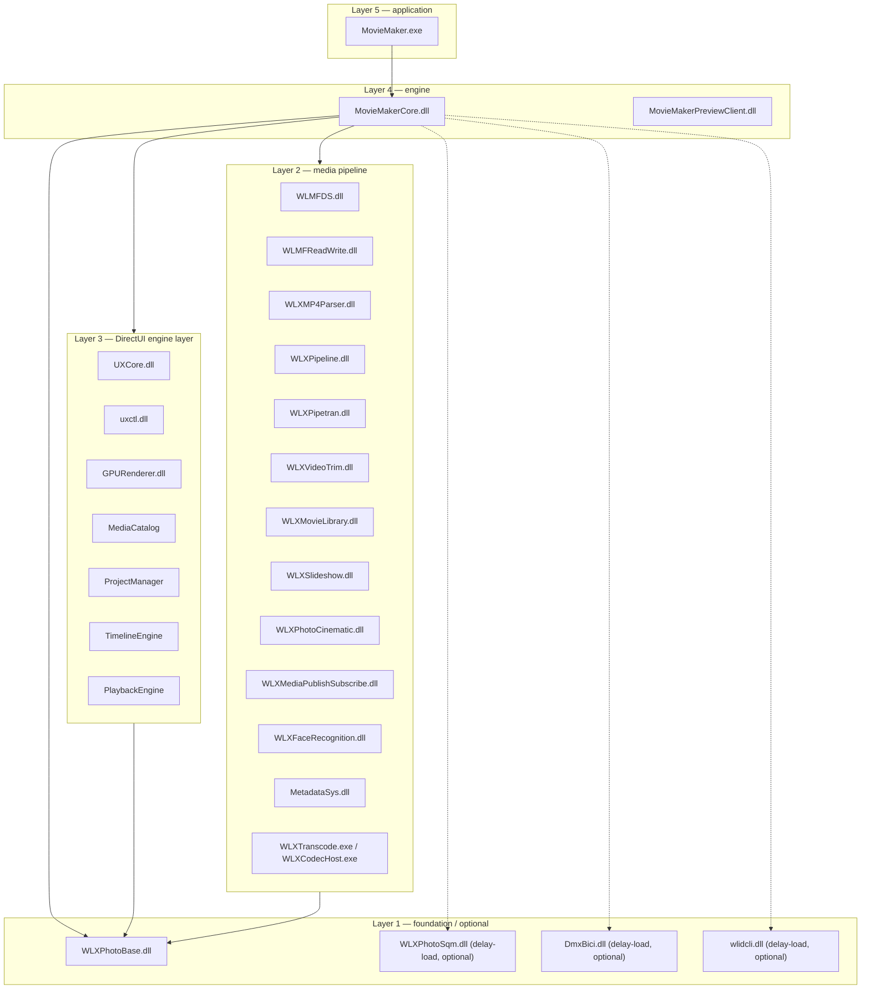

# Module Map

## Target inventory

The root `CMakeLists.txt` adds 29 module subdirectories. Targets are added in dependency
order (foundation first, engine last):

| # | CMake target | Source dir | Type | Family |
|---|---|---|---|---|
| 1 | `WLXPhotoBase` | `src/WLXPhotoBase/` | DLL | Platform |
| 2 | `WLXMovieLibrary` | `src/WLXMovieLibrary/` | DLL | Pipeline & effects |
| 3 | `WLXVideoTrim` | `src/WLXVideoTrim/` | DLL | Pipeline & effects |
| 4 | `WLXPipeline` | `src/WLXPipeline/` | DLL | Pipeline & effects |
| 5 | `WLXPipetran` | `src/WLXPipetran/` | DLL | Pipeline & effects |
| 6 | `WLXMediaPublishSubscribe` | `src/WLXMediaPublishSubscribe/` | DLL | Platform |
| 7 | `WLXSlideshow` | `src/WLXSlideshow/` | DLL | Pipeline & effects |
| 8 | `WLXPhotoCinematic` | `src/WLXPhotoCinematic/` | DLL | Pipeline & effects |
| 9 | `WLXFaceRecognition` | `src/WLXFaceRecognition/` | DLL | Platform |
| 10 | `WLXCodecHost` | `src/WLXCodecHost/` | EXE | Media Foundation |
| 11 | `WLXTranscode` | `src/WLXTranscode/` | EXE | Media Foundation |
| 12 | `WLXMP4Parser` | `src/WLXMP4Parser/` | DLL | Media Foundation |
| 13 | `WLMFReadWrite` | `src/WLMFReadWrite/` | DLL | Media Foundation |
| 14 | `WLMFDS` | `src/WLMFDS/` | DLL | Media Foundation |
| 15 | `MovieMakerCore` | `src/MovieMakerCore/` | DLL | Application |
| 16 | `MovieMakerLang` | `src/MovieMakerLang/` | DLL (resource-only) | Application |
| 17 | `MovieMakerPreviewClient` | `src/MovieMakerPreviewClient/` | DLL | Application |
| 18 | `MovieMaker` | `src/MovieMaker/` | EXE (launcher) | Application |
| 19 | `DmxBici` | `src/DmxBici/` | DLL | Platform |
| 20 | `MetadataSys` | `src/MetadataSys/` | DLL | Platform |
| 21 | `UXCore` | `src/UXCore/` | DLL | DirectUI engine layer |
| 22 | `ProjectManager` | `src/Project/` | static lib | DirectUI engine layer |
| 23 | `uxctl` | `src/uxctl/` | DLL | DirectUI engine layer |
| 24 | `wlidcli` | `src/wlidcli/` | DLL | Platform |
| 25 | `MediaCatalog` | `src/Media/` | static lib | DirectUI engine layer |
| 26 | `WLXPhotoSqm` | `src/WLXPhotoSqm/` | DLL | Platform |
| 27 | `TimelineEngine` | `src/Timeline/` | static lib | DirectUI engine layer |
| 28 | `GPURenderer` | `src/Renderer/` | DLL | DirectUI engine layer |
| 29 | `PlaybackEngine` | `src/Playback/` | static lib | DirectUI engine layer |

(`src/WTL/` is the vendored WTL 10 header set — not a build target.)

## Dependency layers



Dashed edges are **delay-loaded and optional** — the engine must survive their absence on
modern Windows ([Quirk #11](../methodology/quirks.md#11-delay-loaded-dlls-that-no-longer-exist)).

## What links what

Each module's `CMakeLists.txt` declares its system import libraries explicitly. The common
system set (root `CMakeLists.txt`) is:

```text
kernel32 user32 gdi32 shell32 ole32 oleaut32 advapi32 shlwapi gdiplus
d3d11 d3d9 d3dcompiler dxva2 mfplat mf dwmapi uxtheme version winmm
XmlLite windowscodecs oleacc propsys esent d2d1 dwrite
```

Notable per-module additions:

- `MovieMakerCore` — D3D11/D2D/DWrite/MF plus `crypt32` (DPAPI for the PSA auth store) and
  `XmlLite` (project serialization).
- `WLXVideoTrim` — DirectShow-era interfaces (`strmiids`, `quartz`) for its
  DirectShow-based trimming pipelines.
- `MovieMaker` (launcher) — links the **static** CRT and delay-loads `MovieMakerCore.dll`.

Full per-module detail: see each page in the [Module Reference](../modules/overview.md).

## Source directory conventions

Every module follows the same micro-layout:

```text
src/<Module>/
  CMakeLists.txt      # project() + add_library/add_executable + def file
  <Module>.def        # export table (Name @ordinal) — most modules
  dllmain.cpp         # DLL entry (COM registration entries where applicable)
  <Module>.cpp/.h     # implementation + public header
  README.md           # module-specific notes (most modules)
```

`MovieMakerCore` is the exception — a full subsystem tree of 349 files described in
[Architecture Overview](overview.md).
