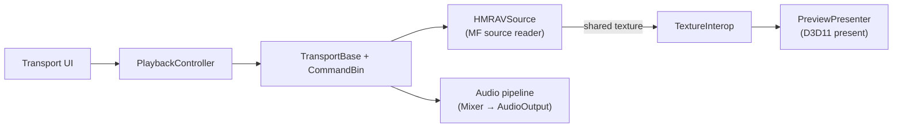

# Preview & Transport

**Locations:** `src/MovieMakerCore/Preview/` and
`src/MovieMakerCore/StoryboardManager/Transport/`

Two cooperating subsystems turn the project model into moving pictures: the **transport**
decides *what* plays and *when*, and the **preview** renders it.

## Preview

| File | Role |
|---|---|
| `PreviewPresenter.cpp/.h` | Owns the preview surface: D3D11 swap chain management, frame pacing, aspect-ratio-correct presentation |
| `PreviewDataContext.cpp/.h` | `IDispatch` data binding for preview UI (transport buttons, time display) |

The presenter receives frames from HMRAVSource's `TextureInterop` (shared D3D11 textures)
and composites them through HMREngine's scene graph — overlays (captions, effects) are
scene nodes, not separate draws.

A separate module, **MovieMakerPreviewClient.dll** (`src/MovieMakerPreviewClient/`),
exposes the preview-window communication interface used by the application to interact
with an embedded preview pane: window creation/lifecycle, seek + render-single-frame
requests, transport control, resize/aspect handling, and snapshot capture. See its
[module page](../../modules/application/moviemakerpreviewclient.md).

## Transport

**Location:** `src/MovieMakerCore/StoryboardManager/Transport/`

| Component | Role |
|---|---|
| `TransportBase` | Playback state machine: stopped/playing/paused/scrubbing, rate, position |
| **CommandBin** | Queue of transport commands (play, pause, seek, rate change) processed in order — enables scrubbing while a seek is in flight |
| Playback plumbing | Clock ownership, end-of-media behavior, loop points |

The UI's `PlaybackController` (SundanceApp) issues transport commands; the transport owns
the authoritative timeline position and notifies the preview and audio subsystems.

### Preserved quirk

The original contains a **null-pointer dereference path in the transport controls**
(reachable through a specific seek-while-stopped sequence):
[Quirk #22](../../methodology/quirks.md#22-null-pointer-dereference-in-transport-controls).
It is reproduced faithfully; the contract suite pins the non-crashing paths around it.

## Frame flow

