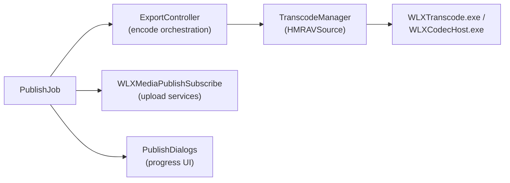

# Publishing

**Location:** `src/MovieMakerCore/Publishing/`

Publishing is the "Save movie" flow: render the timeline, encode it to a service-specific
profile, optionally upload, and report progress.

| File | Role |
|---|---|
| `PublishJob.cpp/.h` | The background job object: owns an encode/upload pipeline instance, progress reporting, cancelation |
| `PublishClasses.cpp/.h` | Service implementations — local-file export and per-service publishing classes |
| `PublishDialogs.cpp` | The publish summary/progress dialog |

## Pipeline

## Current state

The publish pipeline is **partially reconstructed** — by design and documented:

- **Encode stage produces verified test frames, not real video.** The transcode pipeline
  runs, produces deterministic output, and reports correct progress — but the encoder
  writes frames generated for verification, not a real codec stream. This is the largest
  remaining reconstruction gap ([Stub Design](../../methodology/stub-design.md#stub-categories)).
- **Upload services** route through `WLXMediaPublishSubscribe.dll`
  ([module page](../../modules/platform/wlxmediapublishsubscribe.md)); the original
  service plugins (`WLFacebookPlugin`, `WLFlickrPlugin`, `WLVimeoPlugin`, `WLYouTubePlugin`)
  were separate binaries — see `analysis/PublishPlugins/` and
  `analysis/PublishPluginsInterop/` for their binary analysis.

## Historical note: SkyDrive

The original shipped "SkyDrive" (pre-OneDrive branding) as a publish target — a historical
anachronism preserved in resources
([Quirk #7](../../methodology/quirks.md#7-skydrive-branding-historical-anachronism)).
