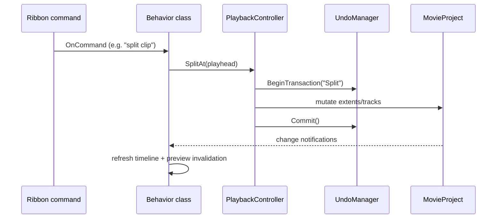

# SundanceApp

**Location:** `src/MovieMakerCore/SundanceApp/`

SundanceApp is the application framework of the engine — the code that owns the process
once `MovieMakerMain` has finished bootstrapping COM/D3D/MF. Named after the original
codename, its classes were recovered from RTTI (`CSundanceApp`, `SundanceAppDataContext`,
`CCommandLineParser`, ...).

## Components

| File | Role |
|---|---|
| `SundanceAppMain.cpp/.h` | `CSundanceApp` — subsystem initialization, main window `WndProc`, message loop teardown |
| `SundanceAppDataContext.cpp/.h` | `IDispatch` data-binding surface consumed by DirectUI markup |
| `ProjectManager.cpp/.h` | Project file I/O orchestration, dirty state, save/save-as flows |
| `AutoSaveManager.cpp/.h` | Periodic crash-safe auto-save of the open project |
| `ImportController.cpp/.h` | Media import (files, devices) into the project |
| `ExportController.cpp/.h` | Export/publish pipeline entry point |
| `MediaBrowser.cpp/.h` | Media browsing surface: thumbnail grid, drag-drop sources |
| `ThumbnailCache.cpp/.h` | Background thumbnail generation (image + video frames) |
| `ClipboardManager.cpp/.h` | System clipboard chain **and** internal clipboard |
| `UndoManager.cpp/.h` | Transaction-based undo/redo stack |
| `PlaybackController.cpp/.h` | Bridges UI transport controls to the storyboard transport |
| `TimelineController.cpp/.h` | Timeline editing operations (split, trim, reorder) |
| `CommandLineParser.cpp/.h` | Startup switches (open project, safemode) |

## The controller pattern

Controllers translate UI intents into model mutations. A typical edit flows:

## Undo/redo design

Undo is **transactional**: every user action opens a transaction on `UndoManager`, applies
one or more model mutations, and commits. Undo pops the transaction and replays its inverse
operations in reverse. The design integrates with the clipboard so that "paste" can be
undone as a unit, and with `MovieProject` dirty-state so unsaved-change prompts are exact.

## Clipboard details worth knowing

`ClipboardManager` participates in the Windows clipboard-viewer chain (via
`SundanceClipboardChainWindow` in the UI layer) and additionally maintains an **internal
clipboard** for rich Movie-Maker-specific payloads (extents with effects) that the system
clipboard cannot represent. Two behaviors are pinned by hardening notes:

- A `GetClipboardData` failure returns **`E_FAIL`** — it previously masked as `S_FALSE`
  (fixed in the 2026-09 hardening pass; see the module
  [README](https://github.com/havaianasdestruido/WindowsMovieMakerDecomp/blob/main/src/MovieMakerCore/README.md)).
- Empty-clipboard / format-not-present remain `S_FALSE` by design — see
  [S_FALSE semantics](../../methodology/stub-design.md#s_false-semantics).

## Auto-save

`AutoSaveManager` writes the project to a recovery location on a timer and on
dirty-state transitions, using the same writer as explicit saves
([Serialization](serialization.md)). Crash recovery on next launch offers the newest
auto-save.

## Related analysis

- `analysis/MovieMakerExe/` — launcher binary analysis
- `analysis/MovieMakerCore/` — engine binary analysis (RTTI, strings, imports)
