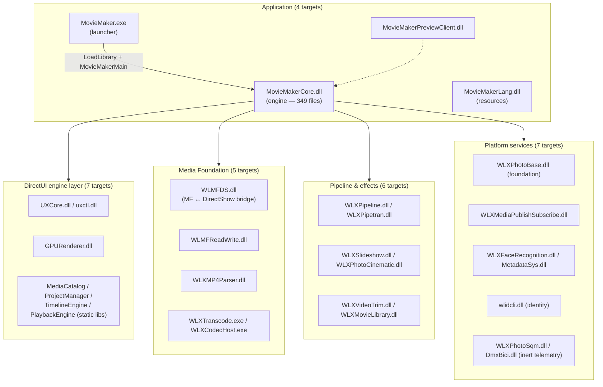

# Architecture Overview

Windows Live Movie Maker 2012 is a **one-EXE + many-DLLs** application. The original
`MovieMaker.exe` is a 54 KB thin launcher; virtually all code lives in `MovieMakerCore.dll`
(10.1 MB, ~5.46 MB of code in the reference binary) with a constellation of supporting
DLLs around it.

The reconstruction mirrors that shape with **29 CMake targets**:

## Inside the engine

`MovieMakerCore.dll` is organized into subsystems, each with its own deep-dive page:

| Subsystem | Directory | Role |
|---|---|---|
| [SundanceApp](moviemakercore/sundance-app.md) | `src/MovieMakerCore/SundanceApp/` | Application framework: main window, controllers, clipboard, undo, auto-save |
| [StoryboardManager](moviemakercore/storyboard-manager.md) | `src/MovieMakerCore/StoryboardManager/` | The project data model: movie project, extents, tracks, templates, themes |
| [HMREngine](moviemakercore/hmr-engine.md) | `src/MovieMakerCore/HMREngine/` | D3D11/D2D/DWrite rendering engine with an X3D-style scene graph |
| [HMRAVSource](moviemakercore/hmr-av-source.md) | `src/MovieMakerCore/HMRAVSource/` | Media Foundation A/V pipeline: sources, sinks, transcoding, audio DSP |
| [UI](moviemakercore/ui.md) | `src/MovieMakerCore/UI/` | DirectUI/Ribbon integration, 50+ behavior classes, timeline UI |
| [Preview & Transport](moviemakercore/preview-transport.md) | `src/MovieMakerCore/Preview/`, `.../StoryboardManager/Transport/` | D3D11 preview rendering and the playback transport command system |
| [Publishing](moviemakercore/publishing.md) | `src/MovieMakerCore/Publishing/` | Background encode/upload jobs and service dialogs |
| [Serialization](moviemakercore/serialization.md) | `src/MovieMakerCore/StoryboardManager/Serialization/` | `.wlmp` project file reader/writer and bound placeholders |
| [Support subsystems](moviemakercore/support-subsystems.md) | `AddIn/`, `External/`, `DataStructs/`, `Resources/` | Add-in contract, external stubs, utility containers, resource IDs |

## Cross-cutting rules

A few invariants span the whole codebase:

- **Every public entry point is `__stdcall` (WINAPI)** except `MovieMakerMain` (`__cdecl`)
  and the UXCore `Resources.cpp` helpers (`__cdecl`). Export decorations must match the
  reference exactly — see [Calling Conventions](calling-conventions.md).
- **Export parity is enforced** via `.def` files (most modules) or `__declspec(dllexport)`
  (UXCore), gated by `tools/diff_exports.py` — see [Stub Design](../methodology/stub-design.md).
- **Telemetry is inert** — `WLXPhotoSqm` and `DmxBici` export full surfaces but never send
  data off-machine.
- **Untrusted input is bounded** — all file parsers carry depth/count/size caps; see
  [Security](../reference/security.md).
- **Original bugs are preserved** — 23 documented quirks are intentional behavior, not
  defects; see [Preserved Quirks](../methodology/quirks.md).

## Where to go next

- [Application Flow](application-flow.md) — the exact startup sequence, from `WinMain` to a
  rendered frame.
- [Module Map](module-map.md) — which target links what, and the dependency graph.
- [Module Reference](../modules/overview.md) — one page per build target.
