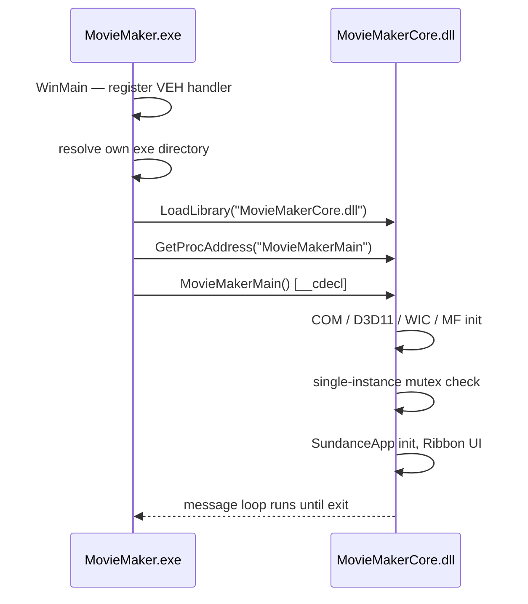

# Running

## Launch the app

```powershell
build\bin\Debug\MovieMaker.exe
```

A window titled **"Windows Live Movie Maker"** appears. The launcher is deliberately tiny
(~94 KB, ~4.8 KB of code in the original) — all real work happens in `MovieMakerCore.dll`.

## What happens at startup

The full flow is described in [Application Flow](../architecture/application-flow.md); in
short:



Two details are load-bearing and deliberately preserved:

1. **Vectored Exception Handler** — the launcher installs a VEH that intercepts MSVC C++
   exception codes (`0xe06d7363` and subcodes, including the undocumented `0x01994000`)
   before the outer SEH catches the unwind. This mirrors the original binary's
   RTTI-corruption paranoia. See [Quirk #1](../methodology/quirks.md#1-double-exception-protection-pattern-veh--seh).
2. **Single-instance mutex** — named `Global\WindowsLiveMovieMaker_Sundance_SingleInstance`
   (note the leaked codename; see
   [Quirk #2](../methodology/quirks.md#2-sundance-codename-leaked-into-runtime-objects)).

## Runtime environment notes

- **Delay-loaded legacy DLLs** — `WLXPhotoSqm.dll`, `DmxBici.dll`, `wlidcli.dll`, and
  `uxcore.dll` are delay-loaded in-process and **do not ship on modern Windows**. The code
  must (and does) survive their absence: telemetry becomes inert, identity falls back to
  no-op. If you delete them, the app still boots.
- **WARP fallback** — the rendering engine prefers hardware D3D11 but falls back to WARP
  (software rasterization), which is the default path on machines without a GPU — as in the
  original. See [Quirk #20](../methodology/quirks.md#20-warp-fallback-as-default-rendering-path).
- **Files on disk** — the PSA authentication store writes only to
  `%LOCALAPPDATA%\Microsoft\WL\MovieMaker\auth.dat`, as a DPAPI-encrypted blob. Nothing else
  is persisted outside your build tree.

## Supporting executables

| EXE | Role | How to run |
|---|---|---|
| `WLXTranscode.exe` | Headless transcode helper used for publishing pipelines | Not a launcher — invoked by the app; do not run directly |
| `WLXCodecHost.exe` | Out-of-process COM codec host | Registers via `DllRegisterServer`-style COM activation; not a launcher |

Only `MovieMaker.exe` is the application entry point.

## Trying individual DLLs

Each supporting DLL is COM-exported or plain-export driven. The exercise apps under `apps/`
(submodules) demonstrate consuming them:

| App | Exercises |
|---|---|
| `apps/photoviewer` | Photo viewing surfaces |
| `apps/transition-plugin` | WLXPipetran transition API |
| `apps/moviemaker-launcher` | Launcher / MovieMakerMain contract |
| `apps/mediapublisher` | WLXMediaPublishSubscribe |
| `apps/video-trimmer` | WLXVideoTrim |
| `apps/metadata-editor` | MetadataSys |
| `apps/slideshow-studio` | WLXSlideshow |
| `apps/face-tagger` | WLXFaceRecognition |
| `apps/movielibrary` | WLXMovieLibrary |
| `apps/pipeline-graph` | WLXPipeline |

Each app repository has its own README with build and run instructions.
