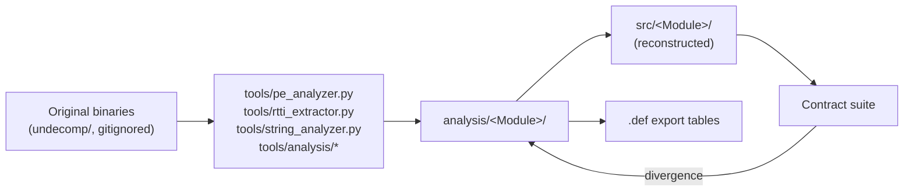

# Binary Analysis Artifacts

The `analysis/` directory is the **gold mine** that made the reconstruction possible: the
extracted ground truth from the original binaries. One directory per module (65 entries),
plus cross-cutting master documents.

## Master documents

| Document | Contents |
|---|---|
| [`analysis/KNOWLEDGE_BASE.md`](https://github.com/havaianasdestruido/WindowsMovieMakerDecomp/blob/main/analysis/KNOWLEDGE_BASE.md) | Continuously-updated shared analysis state: DLL inventory, COM GUIDs (with the corrected FaceRecognition CLSID labels), cross-DLL picture |
| [`analysis/FINAL_SYNTHESIS.md`](https://github.com/havaianasdestruido/WindowsMovieMakerDecomp/blob/main/analysis/FINAL_SYNTHESIS.md) | The complete architecture synthesis: every binary's size, code size, exports, RTTI count, PDB GUID; subsystem mapping |
| [`analysis/CROSS_BINARY_MASTER.md`](https://github.com/havaianasdestruido/WindowsMovieMakerDecomp/blob/main/analysis/CROSS_BINARY_MASTER.md) | Cross-binary relationships |

## Per-module directories

Each module directory holds the extracted evidence for that binary:

- **RTTI class lists** (type names → architecture reconstruction input)
- **Import/export tables** (→ `.def` files and parity gates)
- **String dumps** (ASCII + UTF-16) (→ features, dialogs, registry keys)
- **Resource inventories** (→ `ResourceIds.h` assignments)
- **PE structure notes** (sections, PDB GUID, timestamps)

Examples: `analysis/MovieMakerCore/` (the engine), `analysis/WLXPhotoBase/`,
`analysis/WLXVideoTrim/`, `analysis/WLXMP4Parser/`, ... — matching the
[module reference](../modules/overview.md) one-to-one, plus directories for binaries not
(yet) reconstructed in source (e.g. `analysis/WLXDSPA/`, `analysis/WLXPhotoAcq/`,
`analysis/NPWLPG/`, `analysis/WLFacebookPlugin/`, ...).

## Cross-cutting analysis directories

| Directory | Contents |
|---|---|
| `analysis/COMGuids/` | All COM GUIDs from strings + `.rgs` scripts, with corrections |
| `analysis/CrossDllImports/` | Which DLL imports what from which — the dependency graph |
| `analysis/ThreadModel/` | Threading model per COM class (apartment flags) |
| `analysis/RegRes/` | Registry scripts + resources across binaries |
| `analysis/E_NOTIMPL/` | The audit separating intentional stubs from genuine masking bugs |
| `analysis/BinaryDiff/` | Original-vs-recreation diff tooling output |
| `analysis/Imaging/`, `analysis/Shared/`, `analysis/SharedMFDlls/`, `analysis/D3DCOMPILER_46/`, `analysis/ArchitectureSynthesis/`, ... | Focused deep-dives |

## How analysis feeds reconstruction

**Consult `analysis/` before writing real implementations** — the RTTI and string
evidence usually answers "what did the original actually do here?"

## The tools

The extraction tooling is documented in [Analysis Tools](../tools/analysis-tools.md);
the workflow that produced these artifacts is described in
[Reconstruction Methodology](reconstruction.md).
