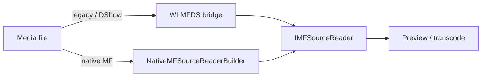

# WLMFDS.dll

| | |
|---|---|
| **Source** | `src/WLMFDS/` |
| **CMake target** | `WLMFDS` |
| **Type** | Win32 COM DLL (427 KB / 345 KB code in the original, 28+ RTTI classes) |
| **Family** | [Media Foundation targets](/modules/media-foundation) |

## At a glance

The **Media Foundation / DirectShow bridge**. Its job: let legacy DirectShow-encoded
content play and transcode through the modern Media Foundation pipeline. Responsibilities
documented in the public header:

- **Filter-graph serialization** (DirectShow graph description ↔ MF)
- **DShow-to-MF source resolution** — producing `IMFSourceReader`s over DirectShow media
- **EVR (Enhanced Video Renderer) integration** for hardware-accelerated preview

## Public surface

The standard COM quartet (`WLMFDS.def`):

```text
DllCanUnloadNow     DllGetClassObject
DllRegisterServer  DllUnregisterServer
```

## Role in the pipeline

`MovieMakerCore`'s `DShowMFSourceReaderBuilder` (in HMRAVSource) is the in-engine client:
when a media file is not natively supported by MF, resolution falls through to this
bridge — see the [HMRAVSource flow](../../architecture/moviemakercore/hmr-av-source.md#source-resolution-strategy).



## Implementation notes

- Built with MSVC 11.0-era header conventions (`STRICT`, `WIN32_LEAN_AND_MEAN`,
  `WINVER 0x0602`), like the other media DLLs.
- COM status: `DllGetClassObject` currently returns `CLASS_E_CLASSNOTAVAILABLE` — no
  servable COM classes are implemented yet — and `DllRegisterServer` /
  `DllUnregisterServer` return `S_OK` without writing registration. The COM surface is
  a documented stub category (see
  [Stub Design](../../methodology/stub-design.md#stub-categories)).

## Testing

- `tests/WLMFDS/` — per-module C++ tests.
- Contract coverage for COM activation in `tests/mmr-python`.

## Analysis artifacts

`analysis/WLMFDS/` (PDB GUID `{41188442-2579-4939-8E66-6697FE148922}`) and
`analysis/SharedMFDlls/`.
