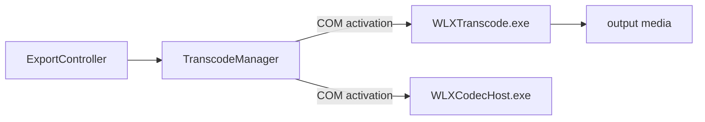

# WLXTranscode.exe

| | |
|---|---|
| **Source** | `src/WLXTranscode/` |
| **CMake target** | `WLXTranscode` |
| **Type** | Win32 EXE (~200 KB / ~120 KB code, ~15 RTTI classes in the original) |
| **Family** | [Media Foundation targets](../media-foundation) |

## At a glance

A **headless transcode worker**: a COM local-server executable activated by the publish /
export pipeline to perform format conversion out of process. In the reference binary it
exports the 4 COM standard entries plus an MFTranscode-related surface.

## Role

`MovieMakerCore`'s `TranscodeManager` (HMRAVSource) coordinates encodes; heavy or
isolated transcodes run in this process, keeping codec crashes away from the editor
process — the standard Windows Live isolation pattern (paired with
[WLXCodecHost.exe](./wlxcodechost.md)).

## Implementation notes

- Single source file (`WLXTranscode.cpp`) — the reconstruction currently implements the
  COM registration surface and the transcode orchestration skeleton; the encoder stage
  writes **verified test frames, not real video** (documented stub category —
  [Stub Design](../../methodology/stub-design.md#stub-categories)).
- Not a launcher: running it directly does nothing user-visible.

## Testing

- Built in the CI matrix; contract coverage of its COM surface in `tests/mmr-python`.
- `tests/OtherDlls/` includes related checks.

## Analysis artifacts

`analysis/WLXTranscode/` (binary inventory in `analysis/FINAL_SYNTHESIS.md`).
