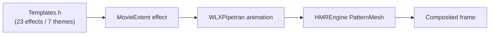

# WLXPipetran.dll

| | |
|---|---|
| **Source** | `src/WLXPipetran/` |
| **CMake target** | `WLXPipetran` |
| **Type** | Win32 DLL |
| **Family** | [Pipeline & effects targets](/docs/modules/pipeline-effects) |

## At a glance

**"Pipetran" = pipeline transformations**: the library of video **transitions and
effects** — the visual grammar of Movie Maker. The header carries **92 RTTI classes**
for transition/effect animations, including exotic wipes:

- `StarWipeTransition`, `BowTieWipeTransition`, `ClockWipeTransition`,
  `PixelateTransition`, and 88 more.

Of these, **22 are stub implementations** — faithfully reproducing the original binary,
which shipped these classes without full implementations
([Quirk #18](../../methodology/quirks.md#18-92-transitioneffect-animation-classes)).

## Public surface

From `WLXPipetran.def`:

```text
GetTFXCreateFunctions @1
```

The "TFX" (transitions/effects) factory returns the versioned create-function table, the
same table pattern as [WLXPipeline](./wlxpipeline.md).

## How transitions render

Templates in MovieMakerCore's `StoryboardManager` reference effects; at render time the
effect resolves to a transition animation from this library, which programs a
**PatternMesh** in HMREngine (the wipe/reveal geometry):



## Implementation notes

- The `DEFINE_STUB_TRANSITION` macro family wires the 22 stub animations. Historical
  bug: the macro originally glued an `L##stringId` prefix onto string IDs — removed
  during reconstruction (Gotcha #19 in `ROADMAP.md`).
- Stub transitions return inert-but-valid behavior (identity/passthrough), never crash —
  matching the original binary's shipped-but-unimplemented surfaces.

## Testing

- Contract coverage for the TFX factory in `tests/mmr-python`.
- Exercise app: `apps/transition-plugin` (submodule).

## Analysis artifacts

`analysis/WLXPipetran/`.
